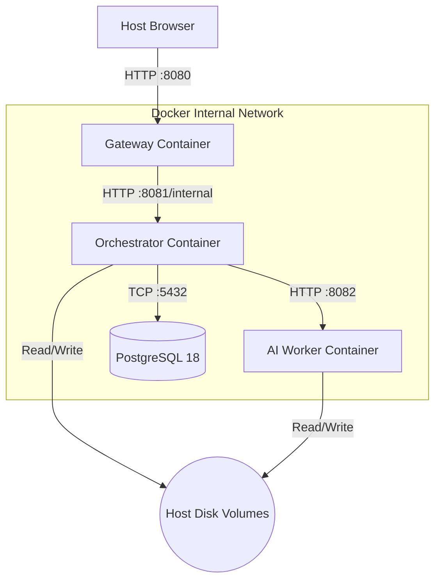

# Sprint 2 : Containerization & Security Hardening

**Cloud-Native Image Processing : Dockerization Phase** _Romano Nicola . SUPSI DTI-ISIN . June 2026_

---

## Table of Contents

[[ _TOC_ ]]

---

## 1. Architecture Overview

Sprint 2 wraps the decomposed microservices into fully isolated, reproducible container environments. By shifting from local OS-bound execution to Docker, the architecture guarantees environment parity across development and production, strictly enforces network isolation, and explicitly manages persistent storage for heavy machine learning payloads.



**Key Container Boundaries:**
* **Gateway (`:8080`)**: The *only* container exposed to the host machine's network interface.
* **Internal Network**: The Orchestrator, AI Worker, and PostgreSQL database are strictly bound to Docker's internal DNS and cannot be accessed directly from the host machine.
* **Persistent Volumes**: AI models (`HF_HOME`, `U2NET_HOME`), file storage (`STORAGE_DATA_DIR`), and the PostgreSQL data directory bypass the ephemeral container layer and are permanently mounted to the host disk.

---

## 2. Security Hardening & The Non-Root Standard

By default, Docker containers run as `root`, which poses a severe security risk and violates Kubernetes Pod Security Standards. All custom application containers in this architecture have been hardened to run as an unprivileged user (`appuser`).

### 2.1 The Volume Mount Trap
When shifting to a non-root user, Docker's volume mounting mechanism introduces a critical edge case: if a `docker-compose.yml` volume is mapped to a container directory that does not exist yet, the Docker daemon automatically creates the directory as `root`. 

When the low-privilege `appuser` attempts to download the ~400MB `.onnx` models into those cache directories, the OS throws a fatal `Permission Denied` error. 

To safely bypass this, the Dockerfiles explicitly pre-create all shared data and cache directories during the build phase and assign full ownership to the `appuser`.

```dockerfile
# Pre-create ALL shared data and cache directories before Docker mounts volumes
RUN mkdir -p /tmp/imageprocessing/data \
             /home/appuser/.cache/huggingface \
             /home/appuser/.u2net && \
    chown -R appuser:appgroup /app /tmp/imageprocessing/data /home/appuser
```

---

## 3. Java Services Dockerization

Both the `gateway` and `orchestrator` utilize a highly optimized, two-stage Docker build process.

### 3.1 Multi-Stage Architecture
1. **Build Stage (`maven:3.9.16-eclipse-temurin-21-alpine`)**: Leverages Docker layer caching by pulling POM files and downloading Maven dependencies *before* compiling the source code. This ensures minor code changes do not trigger massive Maven re-downloads.
2. **Runtime Stage (`alpine/java:21-jre`)**: Strips away the JDK, Maven, and OS utilities, running the compiled `.jar` inside a minimal Alpine JRE.

### 3.2 Configuration Decoupling
To enable containerization, the Spring Boot `application.properties` files were decoupled from `localhost` hardcoding. Database hosts, credentials, and worker URLs are now fully parameterized and injected via environment variables (e.g., `${POSTGRES_HOST:localhost}`).

---

## 4. Python AI Worker Dockerization

Because Python is an interpreted language, its Dockerization strategy differs fundamentally from Java. 

### 4.1 Debian Slim vs. Alpine (The `glibc` Requirement)
While the Java services use Alpine Linux to minimize image size, the Python Worker explicitly utilizes `python:3.13-slim` (a Debian-based image). Alpine uses `musl libc`, which is fundamentally incompatible with the pre-compiled `glibc` wheels required by heavy ML libraries like PyTorch and Torchvision. The `slim` image allows these dependencies to install instantly without compiling from source.

### 4.2 Dependency Isolation and Tooling
1. **`uv` Package Manager**: Used in the build stage to lightning-fast sync dependencies and create an isolated `.venv`.
2. **Runtime Binary Injection**: The runtime stage pulls `ffmpeg` (for media conversion) and `curl` (for healthchecking) via `apt-get`.
3. **Execution**: The entrypoint bypasses the global Python installation and executes directly from the copied virtual environment: `ENTRYPOINT ["/app/.venv/bin/python", "main.py"]`.

---

## 5. Docker Compose Orchestration

The `docker-compose.yml` blueprint binds the isolated containers into a cohesive microservice cluster.

### 5.1 Startup Synchronization (Race Condition Prevention)
Containers booting simultaneously inevitably cause connection crashes (e.g., the Orchestrator attempting to query a database that is still initializing). Compose utilizes the `depends_on` block with `condition: service_healthy` to enforce strict boot sequencing.

* **PostgreSQL Healthcheck**: Pings the DB natively using `pg_isready`.
* **Worker Healthcheck**: Uses `curl` to hit the FastAPI `/health` endpoint. Because the ML models take significant time to load into RAM upon startup, the interval is expanded to `15s` with `10` retries to prevent premature timeout termination.

### 5.2 Environment Vault (`.env`)
To adhere to cloud-native security principles, no sensitive credentials or host-specific paths are hardcoded in the Compose file. An excluded `.env` file feeds `POSTGRES_USER`, `POSTGRES_PASSWORD`, and `STORAGE_DATA_DIR` into the cluster at runtime.

---

## 6. Automated Infrastructure Validation

To ensure the architectural hardening constraints are maintained in the future, a Bash script (`validate_infra.sh`) automatically audits the cluster.

**Phase 1 Validations:**
1. **Health Verification**: Scans `docker compose ps` to ensure no containers are crashing or flagged as `unhealthy`.
2. **Network Isolation**: Verifies that internal ports (`5432` for DB, `8082` for Worker) are not exposed to the host machine.
3. **Gateway Exposure**: Verifies the Gateway correctly binds to port `8080`.
4. **Privilege Hardening**: `exec`s into the Worker container and runs `whoami` to verify the execution context is exactly `appuser`.
5. **Internal DNS Routing**: Verifies the Gateway can internally `ping` the Orchestrator via Docker's built-in DNS.

---

## 7. End-to-End API Validation

A robust, stateful Python `pytest` suite (`test_e2e.py`) simulates a real frontend user to validate that all four containers communicate seamlessly under load.

### 7.1 Testing Strategy
1. **Stateful Sequence**: The test creates a User, uploads an Image, retrieves the DB IDs, and passes them dynamically downstream to generate processing Jobs.
2. **Edge-Case Prevention**: Instead of uploading a random file or arbitrary bytes, the script uploads a mathematically valid, Base64-encoded `1x1` transparent PNG. This prevents the `Pillow` and `rembg` ML libraries from throwing fatal `OSError` EXIF-truncation exceptions during processing.
3. **Asynchronous Concurrency**: Utilizes Python's `concurrent.futures.ThreadPoolExecutor` to fire three independent ML jobs simultaneously (Format Conversion, Background Removal, Object Detection).
4. **Active Polling**: Tests the asynchronous architecture by polling the `GET /api/jobs/{id}` endpoint until the Orchestrator returns a `DONE` status.
5. **Idempotent Cleanup**: Automatically issues a `DELETE /api/users/{id}` request at the end, triggering a PostgreSQL cascade-delete to leave the database completely clean.

---

## 8. Local Cluster Execution

```bash
# 1. Boot the architecture in detached mode, rebuilding the hardened images
docker compose up -d --build

# 2. View unified cluster logs to monitor ML model downloads and boot sequences
docker compose logs -f

# 3. Execute the Infrastructure Security Audit
chmod +x validate_infra.sh
./validate_infra.sh

# 4. Execute the End-to-End API Validation Suite
cd test
uv venv .venv
source .venv/bin/activate
uv pip install pytest requests
uv run pytest test_e2e.py -v -s
```

---

## 9. Sprint Completion Status

| Task | Acceptance Criterion | Status | Notes |
|---|---|---|---|
| Decouple Config | Remove `localhost` references in Spring Boot `application.properties` | Done | Environment variable injection mapped |
| Multi-stage Java | Dockerfiles leveraging Maven caching and `alpine/java:21-jre` | Done | Dramatic reduction in container size |
| Multi-stage Python | Debian `slim` used to preserve `glibc` for PyTorch, `uv` sync | Done | `curl` added for healthchecks |
| Security Hardening | Containers run as `appuser` (non-root) | Done | Volume Mount Trap fixed via `mkdir -p` |
| Orchestration | `docker-compose.yml` with strict startup sequencing | Done | `depends_on: condition: service_healthy` |
| External Models | ML caches mapped to persistent host volumes | Done | Bypasses 400MB re-downloads per build |
| Infrastructure Test | Automated script checking user isolation and exposed ports | Done | Validates `.sh` execution context |
| E2E Concurrency | Python `pytest` suite hitting Gateway and polling async Jobs | Done | Fixed Exif parsing crashes with valid PNG |

## 10. Alternative Build Strategy: Cloud Native BuildPacks (Experimental)

As a supplementary experiment, the Java services were also built using **Cloud Native Buildpacks (CNB)** via the `spring-boot:build-image` Maven goal — an alternative to hand-authored Dockerfiles. Since `spring-boot-maven-plugin` is already declared in both `gateway` and `orchestrator` modules, no additional plugins or dependencies are required.

```bash
# Build OCI-compliant images without a Dockerfile
mvn -pl gateway     spring-boot:build-image -DskipTests
mvn -pl orchestrator spring-boot:build-image -DskipTests
```

The plugin delegates to the **Paketo Buildpacks** provider, which automatically detects the Java 21 runtime, resolves dependencies, and produces a layered OCI image. The approach runs non-root by default and requires no explicit user configuration, but offers significantly less transparency and control over the final image layers compared to the multi-stage Dockerfiles described in Section 3.

The Python AI Worker is explicitly excluded: Paketo's Java buildpack does not cover Python runtimes, and the Worker's `glibc`/PyTorch constraints mandate the hand-authored `python:3.13-slim` Dockerfile regardless.

> This strategy is not carried forward into the thesis. The manual Dockerfiles remain the canonical build path due to their minimal Alpine-based image sizes, explicit `appuser` privilege hardening, and full cross-runtime coverage. Refer to the dedicated BuildPacks note (./notes/9-buildpacks.md) for a full trade-off analysis.

