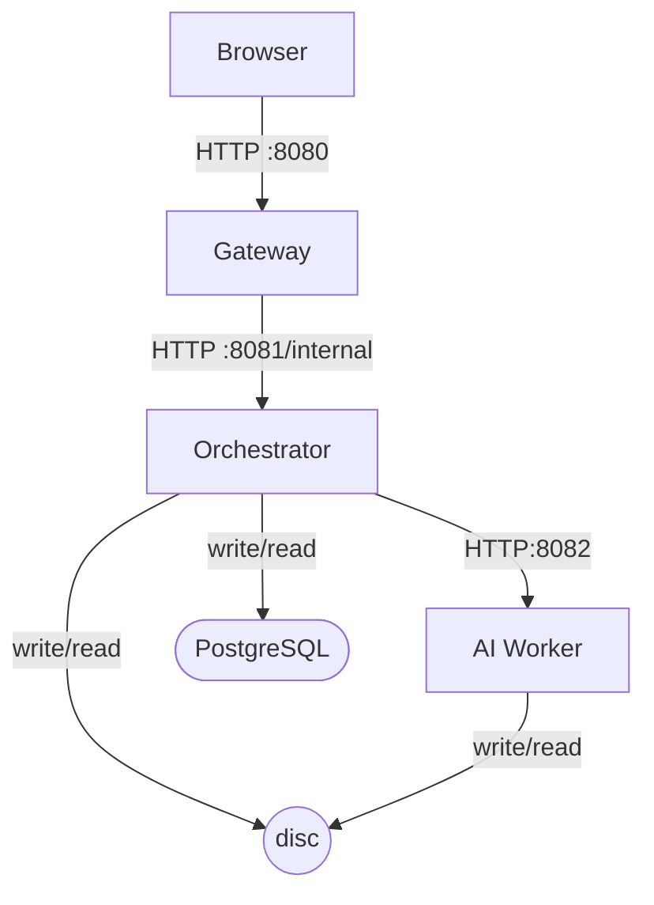

# Sprint 2 : Microservices Decomposition

**Cloud-Native Image Processing : Microservices Phase** _Romano Nicola . SUPSI DTI-ISIN . June 2026_

---

## Table of Contents

1. [Architecture Overview](#1-architecture-overview)
2. [Repository and Build Structure](#2-repository-and-build-structure)
3. [Common Module](#3-common-module)
4. [Orchestrator Service](#4-orchestrator-service)
5. [Gateway Service](#5-gateway-service)
6. [AI Worker Service](#6-ai-worker-service)
7. [Inter-Service Communication](#7-inter-service-communication)
8. [Cross-Cutting Design Decisions](#8-cross-cutting-design-decisions)
9. [REST API Reference](#9-rest-api-reference)
10. [Local Development](#10-local-development)
11. [Sprint 2 Completion Status](#11-sprint-2-completion-status)

---

## 1. Architecture Overview

Sprint 2 decomposes the Spring Boot monolith built in Sprint 1 into four independently deployable services. The decomposition is driven by two goals: separating concerns along natural architectural boundaries, and isolating the compute-intensive AI workload so it can scale independently.



**Traffic flow for a processing job:**

1. Browser uploads an image via `POST /api/images` → Gateway → Orchestrator stores file and creates `Image` record
2. Browser creates a job via `POST /api/images/{id}/jobs` → Gateway → Orchestrator creates `ProcessingJob` record with status `PENDING`
3. Browser triggers execution via `POST /api/jobs/{id}/process` → Gateway → Orchestrator sets status to `RUNNING` and dispatches async call to Worker
4. Worker reads source file from shared storage, processes it, writes output file, returns `target_sk`
5. Orchestrator sets job status to `DONE` and persists `targetStorageKey`
6. Browser polls `GET /api/jobs/{id}` until status is `DONE`, then downloads via `GET /api/jobs/{id}/result`

### 1.1 Technology Stack

| Layer | Technology | Version / Notes |
|---|---|---|
| Runtime (Java) | OpenJDK | 21 (LTS) |
| Framework (Java) | Spring Boot | 4.0.6 |
| HTTP Client | Spring WebFlux WebClient | used in blocking mode with `.block()` |
| Build | Apache Maven multi-module | 3.9.16 |
| Runtime (Python) | Python | 3.13 |
| Framework (Python) | FastAPI + Uvicorn | production ASGI server |
| Package Manager (Python) | uv | replaces pip/poetry |
| Format Conversion | FFmpeg via ffmpeg-python | system binary, fluent Python wrapper |
| Background Removal | rembg | `isnet-general-use` model, ~200MB |
| Object Detection | Deformable DETR | `SenseTime/deformable-detr-with-box-refine`, ~164MB, COCO 2017 |
| ML Framework | PyTorch (CPU) | torch + torchvision from PyTorch CPU wheel index |
| Image Annotation | Pillow | bounding box drawing for object detection output |
| Database | PostgreSQL | 18, owned exclusively by orchestrator |
| Testing (Java) | JUnit 5 + Mockito | service-layer unit tests |
| Testing (Python) | pytest + httpx | endpoint integration tests via TestClient |

---

## 2. Repository and Build Structure

### 2.1 Maven Multi-Module Layout

The repository is restructured from a single Maven project into a multi-module layout with a parent POM at the root:

```
cloud-native-image-processing/
├── pom.xml              ← parent pom (packaging=pom)
├── common/              ← shared DTOs, enums, exceptions (plain JAR)
├── orchestrator/        ← domain service (Spring Boot fat JAR)
├── gateway/             ← BFF service (Spring Boot fat JAR)
├── worker/              ← Python FastAPI service (uv project)
└── docs/
    └── 2-microservices-and-dockerization/notes/
```

The inheritance chain is:

```
spring-boot-starter-parent
        ^
cloud-native-image-processing  (parent pom)
        ^          ^          ^
    common    orchestrator  gateway
```

This means dependency versions, Java version, and compiler settings are declared once and flow to all child modules. When running `mvn clean package` from the root, Maven resolves the build order automatically from the dependency graph: `common` builds first since `orchestrator` and `gateway` both depend on it.

### 2.2 Module Responsibilities

| Module | Type | Purpose |
|---|---|---|
| `common` | Plain JAR | Shared DTOs, enums, exceptions. No Spring dependencies. |
| `orchestrator` | Spring Boot fat JAR | Domain logic, JPA entities, job lifecycle, storage, worker client. |
| `gateway` | Spring Boot fat JAR | Public API, BFF pattern, UI serving, error forwarding. |
| `worker` | Python uv project | AI processing: FFmpeg, rembg, Deformable DETR. |

---

## 3. Common Module

### 3.1 Purpose and Constraints

The `common` module contains everything shared between `orchestrator` and `gateway`: DTOs, enums, and exception classes. The rule is strict — `common` must have no Spring dependencies and no framework opinions. It is a plain Java library.

The only allowed dependencies are `jackson-databind` (for JSON serialization of record types) and `jakarta.validation-api` (for `@NotNull`, `@Pattern` annotations on request DTOs).

Adding any Spring dependency to `common` propagates transitively to all modules that import it. During this sprint, adding `spring-boot-starter-webmvc` to `common` caused a `BeanDefinitionOverrideException` in `orchestrator` because it pulled in `spring-boot-starter-jdbc`, registering a second `transactionManager` bean that conflicted with the JPA-registered one. The fix was to remove the Spring dependency from `common` entirely.

### 3.2 Package Structure

```
common/src/main/java/ch/supsi/imageprocessing/common/
├── dto/
│   ├── ImageResponse.java
│   ├── JobResponse.java
│   ├── UserResponse.java
│   ├── JobRequest.java
│   ├── UserRequest.java
│   ├── ErrorResponse.java
│   ├── ConvertFormatRequest.java
│   ├── RemoveBackgroundRequest.java
│   ├── ObjectDetectionRequest.java
│   └── WorkerResponse.java
├── enums/
│   ├── JobStatus.java
│   └── JobType.java
└── exception/
    ├── ResourceNotFoundException.java
    ├── InvalidRequestException.java
    └── UnsupportedFileFormatException.java
```

### 3.3 Worker Communication DTOs

Three new records were added to `common` to define the worker's HTTP contract. They use `@JsonProperty` on each component to produce snake_case JSON field names matching the Python Pydantic models:

```java
public record ConvertFormatRequest(
    @JsonProperty("source_sk") String sourceSk,
    @JsonProperty("input_format") String inputFormat,
    @JsonProperty("target_sk") String targetSk,
    @JsonProperty("output_format") String outputFormat) {}
```

`@JsonNaming(PropertyNamingStrategies.SnakeCaseStrategy.class)` was initially used but does not work reliably on Java records in all Jackson versions. `@JsonProperty` on each component is explicit and version-independent.

### 3.4 ErrorResponse Timestamp Decision

`ErrorResponse` uses `String` for the timestamp field rather than `LocalDateTime`. This was a deliberate decision to avoid a `JavaTimeModule` dependency in the gateway. The orchestrator serializes `LocalDateTime.now().toString()` before constructing the response, producing an ISO string that is JSON-serializable with a plain `ObjectMapper`. The gateway can deserialize `ErrorResponse` without any Jackson module configuration.

---

## 4. Orchestrator Service

### 4.1 Role

The orchestrator is the domain core. It owns the PostgreSQL database, all JPA entities, the job lifecycle, storage operations, and the HTTP client that calls the worker. It exposes an internal API prefixed with `/internal` via `server.servlet.context-path`, making the prefix apply uniformly at the server level rather than in every controller annotation.

The orchestrator is never called directly by the browser. Only the gateway can reach it.

### 4.2 Key Changes from Monolith

**Controllers moved to gateway** — the public `/api/*` endpoints no longer live in the orchestrator. The orchestrator exposes a leaner internal API shaped for service-to-service calls, without UI concerns such as `Location` headers.

**`ImageProcessor` replaced by `WorkerClient`** — the monolith's `ImageProcessor` class invoked FFmpeg directly via `ProcessBuilder`. In the microservice architecture this responsibility moves to the Python worker. `WorkerClient` is a Spring `@Component` that uses `WebClient` to call the worker's HTTP endpoints.

**`ProcessingJobService.startAsyncProcessExecution` switch expression** — the async execution method dispatches to the correct worker endpoint based on `JobType`:

```java
WorkerResponse result = switch (job.getType()) {
    case FORMAT_CONVERSION -> wc.convertFormat(
        new ConvertFormatRequest(
            job.getImage().getStorageKey(),
            job.getImage().getFormat(),
            job.getTargetStorageKey(),
            job.getTargetFormat()
        )
    );
    case BACKGROUND_REMOVAL -> wc.removeBackground(
        new RemoveBackgroundRequest(
            job.getImage().getStorageKey(),
            job.getTargetStorageKey()
        )
    );
    case OBJECT_DETECTION -> wc.detectObjects(
        new ObjectDetectionRequest(
            job.getImage().getStorageKey(),
            job.getTargetStorageKey()
        )
    );
};
job.setStatus(JobStatus.DONE);
```

Exhaustive switch on enum — no `default` arm. If a new `JobType` is added without a corresponding arm, the code will not compile, forcing the developer to handle it explicitly.

**`ImageFormatValidator` normalization** — the validator now maps MIME types to canonical format names via a `Map<String, String>` rather than extracting the MIME subtype directly. This ensures `image/jpeg` is stored as `"jpg"` rather than `"jpeg"`, establishing a consistent canonical name that flows through the entire system.

### 4.3 Package Structure

```
orchestrator/src/main/java/ch/supsi/imageprocessing/
├── client/
│   └── WorkerClient.java
├── config/
│   ├── WorkerWebClientConfig.java
│   ├── AsyncConfig.java
│   └── ObservationConfig.java
├── controller/
│   ├── UserController.java
│   ├── ImageController.java
│   └── ProcessingJobController.java
├── entity/
│   ├── User.java
│   ├── Image.java
│   └── ProcessingJob.java
├── mapper/
│   ├── UserMapper.java
│   ├── ImageMapper.java
│   └── JobMapper.java
├── repository/
│   ├── UserRepository.java
│   ├── ImageRepository.java
│   └── ProcessingJobRepository.java
├── service/
│   ├── UserService.java
│   ├── ImageService.java
│   ├── ProcessingJobService.java
│   └── StorageService.java
└── utils/
    └── ImageFormatValidator.java
```

### 4.4 WorkerClient Bean Name

`WorkerClient` is annotated with `@Component`, which registers it in the Spring context under the bean name `workerClient` (camelCase of the class name). The `@Bean` method in `WorkerWebClientConfig` must not also be named `workerClient`, or Spring throws a `BeanDefinitionOverrideException`. The config bean method is named `workerWebClient()` to avoid the clash.

---

## 5. Gateway Service

### 5.1 Role

The gateway is the only service the browser communicates with directly. It implements the **Backend For Frontend (BFF)** pattern: it presents a public-facing API shaped for the UI, serves the static frontend, and forwards all requests to the orchestrator via HTTP. It owns no database and contains no domain logic.

It also acts as the security boundary — JWT validation will be added here in a later sprint. The orchestrator will trust only calls from the gateway.

### 5.2 WebClient Configuration

`WebClient` is used to call the orchestrator. It is the modern Spring HTTP client; `RestTemplate` is in maintenance mode. `WebClient` is designed for reactive, non-blocking code but is used in blocking mode here (`.block()` on each response) because the gateway runs on Tomcat, not a reactive runtime. The tradeoff is acceptable since the bottleneck in this system is AI inference in the worker, not thread availability in the gateway.

The `WebClientConfig` `defaultStatusHandler` intercepts all 4xx and 5xx responses and reads the body as a raw `String` before wrapping it in a `WebClientResponseException`. Reading the body as `String` rather than deserializing directly is critical — `WebClient`'s internal `ObjectMapper` does not share the Spring-managed instance and cannot handle certain field types.

The in-memory buffer limit is set to 10MB to accommodate large processed images. The default WebClient buffer limit is 256KB, which caused `DataBufferLimitException` on annotated images produced by the object detection pipeline.

### 5.3 Error Forwarding

The `GlobalExceptionHandler` catches `WebClientResponseException`, deserializes the raw body into `ErrorResponse` using the Spring-managed `ObjectMapper`, re-stamps the `path` field with the gateway's request URI (replacing the internal `/internal/*` path), and returns the error to the browser with the original HTTP status code. This makes the gateway transparent for errors: a 409 from the orchestrator arrives at the browser as a 409.

### 5.4 Input Validation

The gateway validates all inputs before forwarding:
- `@Validated` at controller class level enables path variable constraint checking
- `@Min(0)` on all `Long id` path variables rejects negative IDs immediately
- `@Valid` on request body parameters validates structure before forwarding
- `JobRequest.targetFormat` is validated against a `@Pattern` allowing only canonical format names: `^(jpg|png|gif|webp|bmp)$`

The orchestrator performs the same validation independently as a second line of defence. The gateway catches cheap, obvious errors; the orchestrator remains authoritative on domain correctness.

---

## 6. AI Worker Service

### 6.1 Role

The worker is the compute-intensive service. It receives job requests from the orchestrator, executes the processing, writes the output file to the shared storage directory, and returns the output storage key. It is the primary justification for the microservices architecture — it is CPU and RAM intensive, written in a different language (Python), and is the only service that needs to scale horizontally under load.

### 6.2 Endpoints

| Endpoint | Input model | Processing |
|---|---|---|
| `GET /health` | — | Returns status and list of loaded model keys |
| `POST /convert_format` | `ProcessRequest` | FFmpeg format conversion |
| `POST /remove_background` | `BackgroundRemovalRequest` | rembg background removal |
| `POST /detect_objects` | `ObjectDetectionRequest` | Deformable DETR object detection with Pillow annotation |

### 6.3 Model Loading

All models are loaded once at startup using FastAPI's `lifespan` context manager. The structure is flat — a single `yield` after all models are loaded, with no nested `async with` blocks. Nesting `async with` blocks inside `lifespan` causes a `TypeError` at startup because the inner context manager is not a valid async iterator in this context.

```python
@asynccontextmanager
async def lifespan(app: FastAPI):
    ml_models["rembg"] = new_session("isnet-general-use")
    processor = AutoImageProcessor.from_pretrained("SenseTime/deformable-detr-with-box-refine")
    model = DeformableDetrForObjectDetection.from_pretrained("SenseTime/deformable-detr-with-box-refine")
    model.eval()
    ml_models["detr_processor"] = processor
    ml_models["detr_model"] = model
    yield
    ml_models.clear()
```

The application is not ready to serve requests until all models are loaded. This is intentional — in Kubernetes, the readiness probe will not pass until startup completes.

### 6.4 FFmpeg Format Translation

FFmpeg does not recognize user-facing format names (`jpg`, `png`) for output. The worker maintains a `FFMPEG_CODEC_MAP` that translates canonical names to FFmpeg codec and muxer identifiers. This is the only place in the system where FFmpeg internals are referenced:

| Canonical name | FFmpeg vcodec | FFmpeg muxer (f) |
|---|---|---|
| `jpg` / `jpeg` | `mjpeg` | `image2` |
| `png` | `png` | `image2` |
| `gif` | `gif` | `gif` |
| `webp` | `libwebp` | `webp` |
| `bmp` | `bmp` | `image2` |

FFmpeg auto-detects the input format from the file's magic bytes — no `-f` flag is passed on the input side since storage keys have no file extension.

### 6.5 Testing Strategy

Tests use `TestClient(app, raise_server_exceptions=False)` — the `raise_server_exceptions=False` parameter is required when asserting 500 responses, because by default `TestClient` re-raises server exceptions in the test process rather than returning the HTTP response.

The rembg session and DETR model are replaced with `MagicMock` instances via `monkeypatch.setitem(ml_models, "rembg", mock)` before every test. The storage directory is redirected to `tmp_path` via `monkeypatch.setenv`. The `safe_path()` function reads the environment variable at call time rather than module load time specifically to allow this monkeypatching to work.

---

## 7. Inter-Service Communication

### 7.1 Gateway → Orchestrator

The gateway calls the orchestrator via a Spring `WebClient` bean configured in `WebClientConfig`. The base URL is read from the `ORCHESTRATOR_URL` environment variable, defaulting to `http://localhost:8081/internal` for local development.

All JSON serialization uses Spring's default `ObjectMapper`. List responses are deserialized using `ParameterizedTypeReference` rather than `bodyToFlux`, which proved unreliable with empty arrays.

### 7.2 Orchestrator → Worker

The orchestrator calls the worker via a second `WebClient` bean configured in `WorkerWebClientConfig`. The base URL is read from the `WORKER_URL` environment variable, defaulting to `http://localhost:8082`.

**Snake_case serialization** — the Python worker expects snake_case JSON (`source_sk`, `input_format`), but Jackson defaults to camelCase (`sourceSk`, `inputFormat`). The fix is to annotate each record component with `@JsonProperty`:

```java
public record ConvertFormatRequest(
    @JsonProperty("source_sk") String sourceSk,
    @JsonProperty("input_format") String inputFormat,
    ...
```

`@JsonNaming` on records was attempted first but does not work reliably across Jackson versions. `@JsonProperty` per component is the reliable approach.

**Call site** — `WorkerClient` methods are called from `ProcessingJobService.startAsyncProcessExecution` which runs in a thread managed by Spring's `@Async` executor. The `.block()` call inside `WorkerClient` is acceptable here because the thread is already a background worker thread, not a request-handling thread.

### 7.3 Shared Storage

The orchestrator and worker share a flat storage directory. Both services read the path from `STORAGE_DATA_DIR`. Files are identified by UUID-based storage keys — no paths are passed over HTTP. Both services validate that resolved paths stay within the configured base directory (`safe_path` in Python, `StorageService` path check in Java) to prevent path traversal attacks.

---

## 8. Cross-Cutting Design Decisions

### 8.1 Canonical Format Name

A single canonical format name, `jpg`, flows through the entire system for JPEG images. `ImageFormatValidator` maps MIME types to canonical names at upload time. The UI sends the same canonical names as target format values. The worker's `FFMPEG_CODEC_MAP` is the only translation point between canonical names and FFmpeg-specific identifiers. The string `jpeg` never appears in the system except as a defensive fallback in the codec map.

| Layer | Value |
|---|---|
| Database `format` column | `jpg` |
| `JobRequest.targetFormat` | `jpg` |
| `ConvertFormatRequest.outputFormat` | `jpg` |
| `FFMPEG_CODEC_MAP` translation | `jpg` → `mjpeg` + `image2` |

### 8.2 BFF Pattern and API Ownership

The gateway owns the public API contract (`/api/*`). The orchestrator exposes only an internal API (`/internal/*`). UI concerns — response shaping, `Content-Disposition` headers on downloads, `Location` headers on creation — are handled by the gateway. The orchestrator is a pure domain service unaware of how responses are presented to the browser.

### 8.3 Error Response Design

`ErrorResponse` in `common` uses `String` for the timestamp to avoid introducing a `JavaTimeModule` dependency in the gateway. The orchestrator serializes `LocalDateTime.now().toString()` producing an ISO-8601 string. The gateway deserializes it with a plain `new ObjectMapper()`, re-stamps the `path` field, and forwards it to the browser. This eliminates a cross-module Jackson configuration dependency at the cost of losing the Java type on the receiving end — an acceptable tradeoff since `ErrorResponse` is a transport DTO, never used for date arithmetic.

### 8.4 Synchronous Worker Calls

The orchestrator calls the worker synchronously within an `@Async` background thread. This means each processing job holds one background thread for the duration of the worker call. For this project this is acceptable — the thread pool is sized for the expected job concurrency and the bottleneck is AI inference time, not thread availability. A message queue (e.g. RabbitMQ) would be the correct solution at scale but adds infrastructure complexity beyond the scope of this sprint.

### 8.5 Object Detection Output

The object detection endpoint always outputs PNG regardless of input format. The Pillow annotation step creates a new image rather than converting the original, and PNG is lossless and format-neutral. This avoids the complexity of re-encoding annotated images to the original format.

---

## 9. REST API Reference

The public API exposed by the gateway is unchanged from Sprint 1 with the addition of the `OBJECT_DETECTION` job type.

### 9.1 User Endpoints

| Method | Path | Status | Description |
|---|---|---|---|
| `POST` | `/api/users` | 201 Created | Register a new user. Body: `{ username, email }`. |
| `GET` | `/api/users` | 200 OK | List all users. |
| `GET` | `/api/users/{id}/images` | 200 OK | List images owned by a user. |
| `DELETE` | `/api/users/{id}` | 204 No Content | Delete user and cascade-delete images and jobs. |

### 9.2 Image Endpoints

| Method | Path | Status | Description |
|---|---|---|---|
| `POST` | `/api/images` | 201 Created | Upload image (`multipart/form-data`, fields: `file`, `userId`). |
| `GET` | `/api/images/{id}` | 200 OK | Retrieve image metadata. |
| `DELETE` | `/api/images/{id}` | 204 No Content | Delete image and associated jobs. |
| `POST` | `/api/images/{id}/jobs` | 201 Created | Create a processing job. Body: `{ type, outputName, targetFormat }`. |
| `GET` | `/api/images/{id}/jobs` | 200 OK | List all jobs for an image. |

### 9.3 Job Endpoints

| Method | Path | Status | Description |
|---|---|---|---|
| `POST` | `/api/jobs/{id}/process` | 202 Accepted | Trigger async execution. |
| `GET` | `/api/jobs/{id}` | 200 OK | Poll job status. |
| `GET` | `/api/jobs/{id}/result` | 200 OK | Download output file (status must be `DONE`). |
| `DELETE` | `/api/jobs/{id}` | 204 No Content | Delete job. Removes output file if status is `DONE`. |

### 9.4 Supported Job Types

| `JobType` | `targetFormat` required | Output | Processing |
|---|---|---|---|
| `FORMAT_CONVERSION` | Yes (`jpg`, `png`, `gif`, `webp`, `bmp`) | Converted image in requested format | FFmpeg |
| `BACKGROUND_REMOVAL` | No (always PNG) | Image with background removed | rembg `isnet-general-use` |
| `OBJECT_DETECTION` | No (always PNG) | Annotated image with bounding boxes | Deformable DETR + Pillow |

### 9.5 Error Response Structure

```json
{
  "timestamp": "2026-06-18T11:00:01.104054521",
  "status": 409,
  "error": "Conflict",
  "message": "A record with this information already exists.",
  "path": "/api/users",
  "validationErrors": null
}
```

The `path` field always reflects the gateway's request URI, not the internal orchestrator path.

---

## 10. Local Development

All services must be running simultaneously. Each requires its own terminal.

| Service | Port | Command |
|---|---|---|
| PostgreSQL | 5432 | `sudo systemctl start postgresql` |
| Orchestrator | 8081 | `mvn spring-boot:run -pl orchestrator` |
| Gateway | 8080 | `mvn spring-boot:run -pl gateway` |
| Worker | 8082 | `cd worker && uv run python main.py` |

### 10.1 Environment Variables

| Variable | Service | Default | Purpose |
|---|---|---|---|
| `ORCHESTRATOR_URL` | Gateway | `http://localhost:8081/internal` | Orchestrator base URL |
| `WORKER_URL` | Orchestrator | `http://localhost:8082` | Worker base URL |
| `STORAGE_DATA_DIR` | Orchestrator + Worker | `/tmp/imageprocessing/data` | Shared file storage |
| `DETECTION_THRESHOLD` | Worker | `0.5` | Min confidence for object detection |
| `WORKER_PORT` | Worker | `8082` | Uvicorn bind port |

### 10.2 Build Commands

```bash
# Build common and install to local Maven repository
mvn clean install -pl common --also-make

# Build and run all Java services from root
mvn clean package

# Run Java services
mvn spring-boot:run -pl orchestrator
mvn spring-boot:run -pl gateway

# Run Python worker
cd worker
uv sync
uv run python main.py

# Run worker tests
cd worker
uv run pytest test/ -v
```

---

## 11. Sprint 2 Completion Status

| Task | Acceptance Criterion | Status | Notes |
|---|---|---|---|
| Repo restructure (task 23) | Maven multi-module layout with `common`, `orchestrator`, `gateway`, `worker` | Done | Parent POM at repo root, reactor build working |
| Common module (task 24) | Shared DTOs, enums, exceptions extracted; no Spring deps in `common` | Done | `@JsonProperty` on worker DTOs for snake_case |
| Gateway implementation (task 34) | BFF pattern, `/api/*` endpoints, file upload/download, error forwarding | Done | `String` timestamp in `ErrorResponse` to avoid `JavaTimeModule` |
| Worker implementation (task 26) | FastAPI service with `/convert_format`, `/remove_background`, `/health` | Done | FFmpeg codec map, rembg startup loading |
| Orchestrator → Worker communication (task 35) | `WorkerClient` calling worker HTTP endpoints | Done | `@JsonProperty` snake_case fix, `WorkerWebClientConfig` bean name fix |
| Format normalization | Single canonical `"jpg"` name across all services | Done | `ImageFormatValidator` MIME map, `FFMPEG_CODEC_MAP` as sole translation point |
| Input validation | `@Pattern` on `targetFormat`, `@Min(0)` on path IDs | Done | Allows null for non-conversion job types |
| Object detection (task 26+) | Deformable DETR integration with bounding box annotation | Done | `timm` + `torchvision` CPU wheels via explicit uv index |
| Worker tests | 19 passing tests with mocked models and isolated storage | Done | `raise_server_exceptions=False` required for 500 assertions |
| Error forwarding | Gateway re-stamps `path` field, forwards original HTTP status | Done | `WebClientConfig` raw body preservation, 10MB buffer limit |
| Format conversion end-to-end | `jpg`, `png`, `gif` conversion working via UI | Done | |
| Background removal end-to-end | rembg pipeline working via UI, output downloadable | Done | |
| Object detection end-to-end | DETR annotation pipeline working via UI, output downloadable | Done | |

### What is not yet done (planned for next sprints)

| Item | Planned Sprint |
|---|---|
| Dockerfiles for all services | Sprint 3 |
| `docker-compose.yml` for local orchestration | Sprint 3 |
| Kubernetes manifests (Deployments, Services, Ingress, HPA, PVCs) | Sprint 4 |
| CI/CD pipeline (GitLab CI) | Sprint 5 |
| Authentication and authorisation (Keycloak + JWT) | Sprint 6 |
| Service mesh (Istio) | Sprint 7 |
