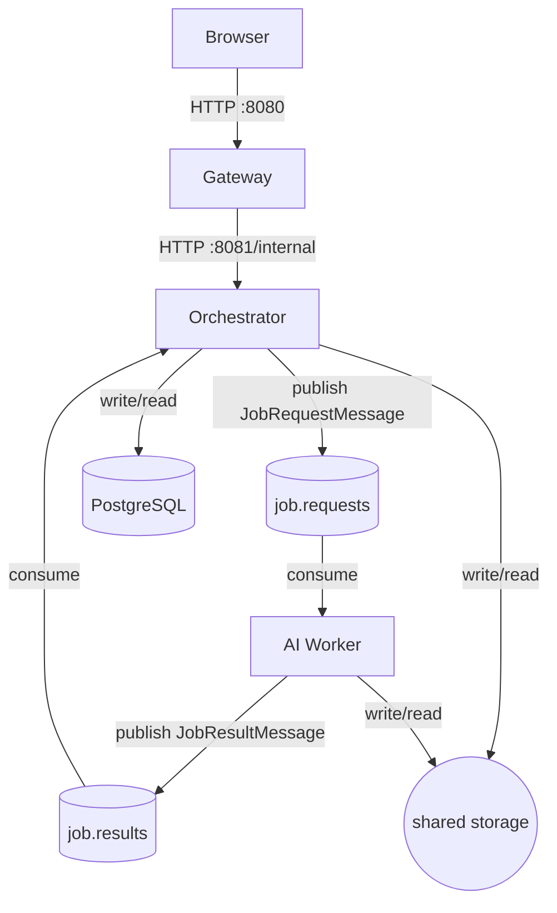

# 9 Apache Kafka

> This guide details the deployment of Apache Kafka and the update of Orchestrator and Worker services to leverage the new service.

---

## 1. Architecture Overview

Sprint 2 left the Orchestrator calling the Worker synchronously over HTTP from within an `@Async` background thread (see `sprint-2-microservices-recap.md`, §8.4). That call held one background thread for the duration of AI inference and offered no buffering: a burst of job creations translated directly into a burst of blocking HTTP calls against the Worker.

Sprint 3 replaces that direct call with two Kafka topics. The Orchestrator no longer knows when or how the Worker processes a job: it publishes a request and later receives a result, asynchronously, on its own schedule.



**Revised traffic flow for a processing job:**

1. `POST /api/images/{id}/jobs` -> Orchestrator creates `ProcessingJob` with status `PENDING`. *(unchanged)*
2. `POST /api/jobs/{id}/process` -> Orchestrator assigns `targetStorageKey`, sets status `RUNNING`, publishes a `JobRequestMessage` to `job.requests`, and returns immediately.
3. Worker consumes the message, runs the matching processing function on a thread-pool executor, writes the output file, and publishes a `JobResultMessage` (`DONE` or `FAILED`) to `job.results`.
4. `JobResultListener` in the Orchestrator consumes `job.results` and updates the job's `status` in PostgreSQL.
5. Browser polls `GET /api/jobs/{id}` until `DONE`: this endpoint is unchanged; it only ever reads the DB.

---

## 2. Motivation: Why a Message Queue

Sprint 2 (`sprint-2-microservices-recap.md`, §8.4) already named the tradeoff explicitly: *"A message queue (e.g. RabbitMQ) would be the correct solution at scale but adds infrastructure complexity beyond the scope of this sprint."* Sprint 3 closes that gap.

Concretely, moving to a queue buys:

- **Thread decoupling**: the Orchestrator's `@Async` executor no longer holds a thread for the duration of AI inference; publishing to Kafka is a fire-and-forget, non-blocking call.
- **Load buffering**: a burst of job creations queues up in `job.requests` instead of becoming a burst of concurrent HTTP calls against a CPU-bound Worker.
- **Independent horizontal scaling**: additional Worker replicas can join the same Kafka consumer group and the partition assignment protocol distributes load automatically, with zero Orchestrator-side changes. This directly extends the HPA-driven scaling story from the Kubernetes deployment phase.
- **Natural backpressure**: if the Worker falls behind, requests simply accumulate in the topic rather than piling up as failed/timed-out HTTP calls.

---

## 3. Design Decisions

### 3.1 Two Topics, Not One-Per-Job-Type

`job.requests` and `job.results`, with `job_type` carried inside the message payload, rather than a dedicated topic per `JobType` (`format-conversion`, `background-removal`, `object-detection`, …).

This mirrors a constraint that already exists in the codebase: `ProcessingJobService.startAsyncProcessExecution` (Sprint 2) used an **exhaustive switch with no `default` arm**: adding a new `JobType` forces a compile error until it's handled. The two-topic design preserves that property: a new job type is a new `switch`/dispatch-table arm, not new topic provisioning, new consumer subscriptions, or new k8s objects.

### 3.2 Message Keying

Both topics are keyed by `jobId` (as a `String`). This guarantees every message for a given job lands on the same partition and is therefore processed in order by a single consumer: relevant if a job is ever re-submitted or retried.

### 3.3 Storage Key Ownership

This was the one design point revisited mid-sprint. Sprint 1/2 had a single rule: `ProcessingJobService.processJob()` assigns `targetStorageKey` via `UUID.randomUUID()` **before** any processing starts, so there is exactly one authority for storage keys.

An early draft of the Kafka integration broke this rule by writing `targetStorageKey` from the Worker's `JobResultMessage` inside `JobResultListener`, i.e. assigning it at *completion* instead of *creation*. This was corrected back to the original rule:

- `targetStorageKey` is still generated in `processJob()`, before the `JobRequestMessage` is even published.
- The Worker receives the key and writes its output there: it never invents one.
- `JobResultListener` only updates `status`. It still reads `target_sk` out of the incoming `JobResultMessage`, but purely as a correlation check: if it doesn't match what the Orchestrator already has on file, that's logged as a warning, not adopted as a new value.

Reasoning:

| | Creation-time assignment (kept) | Completion-time assignment (reverted) |
|---|---|---|
| Source of truth | Orchestrator only | Ambiguous under concurrent writes |
| Kafka redelivery | Idempotent: same key every retry | A regenerated key on retry could orphan a partially-written file |
| `GET /api/jobs/{id}` while `RUNNING` | Already reports the correct key | Key is `null` until the Worker replies |

### 3.4 Delivery Semantics: At-Least-Once

Neither Kafka client is configured for exactly-once semantics: deliberately, since it would require transactional producers/consumers on both the JVM and Python sides for a single-broker, coursework-scale deployment. At-least-once is handled explicitly instead:

- The Worker's `AIOKafkaConsumer` runs with `enable_auto_commit=False` and commits its offset only **after** `job.results` has been published for that message. A Worker crash mid-inference causes the same `job.requests` message to be redelivered rather than silently dropped.
- `JobResultListener` is idempotent by construction: replaying the same `DONE`/`FAILED` status twice is harmless, so a duplicate result delivery (e.g. the Worker publishes but crashes before committing) is safe to reprocess.
- **Known gap:** if `KafkaTemplate.send()` itself fails on the Orchestrator side (broker unreachable at publish time), the job is flipped straight to `FAILED` with no retry. A transactional outbox would close this, but was judged out of scope for this sprint: noted here as a limitation rather than silently left undocumented.

### 3.5 Worker Consumer Library: `aiokafka`

Chosen over `confluent-kafka` because the Worker already structures its startup around FastAPI's async `lifespan` context manager (used since Sprint 2 to load the `rembg` and DETR models once at boot: see `sprint-2-microservices-recap.md`, §6.3). `aiokafka` lets the consumer loop live as a native `asyncio` task started from that same `lifespan`, rather than requiring a separate thread with its own lifecycle to bridge into FastAPI's event loop.

The processing functions themselves (`_convert_format`, `_remove_background`, `_detect_objects`) are blocking (subprocess calls, PyTorch inference), so the consumer loop offloads each one via `loop.run_in_executor(None, handler, payload)`: this keeps the event loop free to service `/health` and continue polling Kafka while a job is being processed.

### 3.6 Kafka Deployment Mode: Single-Broker KRaft

No Zookeeper. `apache/kafka:3.9.0` in KRaft mode (`process.roles=broker,controller`) runs as a single StatefulSet replica: proportionate to a thesis-scale deployment, and one less component to operate alongside Postgres, Keycloak, and the service mesh already on the roadmap.

Topic creation in k8s:

- **Kubernetes (prod path):** auto-create is disabled; a one-shot `Job` (`kafka-create-topics`) creates both topics explicitly with a fixed partition count (`--if-not-exists`, safe to re-run), so partitioning is a deliberate choice rather than whatever the first producer happened to trigger.

---

## 4. Message Schemas

Both messages live in the `common` module as Java records (consistent with the existing `ConvertFormatRequest`/`RemoveBackgroundRequest` worker-DTO convention from Sprint 2: `@JsonProperty` per field for explicit snake_case, since `@JsonNaming` was already found unreliable on records in that sprint).

**`JobRequestMessage`**: Orchestrator -> Worker, topic `job.requests`:

```json
{
  "job_id": 42,
  "job_type": "FORMAT_CONVERSION",
  "source_sk": "b3f1...-uuid",
  "target_sk": "9ac2...-uuid",
  "input_format": "png",
  "output_format": "jpg"
}
```

`input_format` / `output_format` are only meaningful for `FORMAT_CONVERSION`; `null` for the other two job types.

**`JobResultMessage`**: Worker -> Orchestrator, topic `job.results`:

```json
{
  "job_id": 42,
  "status": "DONE",
  "target_sk": "9ac2...-uuid",
  "error_message": null
}
```

`status` is a plain `"DONE"` / `"FAILED"` string rather than the Java `JobStatus` enum, so the Python side has no dependency on a Java-flavoured type.

---

## 5. Orchestrator Implementation

### 5.1 `common` Module Additions

`JobRequestMessage` and `JobResultMessage` added under `common/dto`, alongside the existing worker-communication DTOs from Sprint 2. No Spring dependencies introduced: the `common` module's "plain Java library" constraint (Sprint 2, §3.1) still holds.

### 5.2 Kafka Producer / Consumer Configuration

- `KafkaProducerConfig`: a `KafkaTemplate<String, JobRequestMessage>` backed by `StringSerializer` (key) and `JsonSerializer` (value), with `JsonSerializer.ADD_TYPE_INFO_HEADERS=false` so Spring's `__TypeId__` header — meaningless to the Python consumer — isn't added to the message.
- `KafkaConsumerConfig`: a `ConcurrentKafkaListenerContainerFactory<String, JobResultMessage>` using `ErrorHandlingDeserializer` wrapping `JsonDeserializer`. A malformed `job.results` message is routed to the container's error handler instead of crashing the listener thread outright.

### 5.3 `ProcessingJobService` Changes

`processJob()` retains its original responsibility (assigning `targetStorageKey`, see §3.3) but now also publishes the `JobRequestMessage`, keyed by `jobId`, instead of calling `WorkerClient` synchronously. The publish is fire-and-forget from the caller's perspective: `KafkaTemplate.send()` returns a `CompletableFuture`, so no `@Async` wrapper is needed here; the method returns as soon as the DB write and the (non-blocking) publish call have been issued.

A `whenComplete` callback on that future handles the one failure mode `@Async` used to absorb implicitly: if the publish itself fails (see §3.4), the job is flipped to `FAILED` rather than left stuck in `RUNNING` indefinitely.

`startAsyncProcessExecution`: the Sprint 2 method that held a background thread for the HTTP call to `WorkerClient` — is removed entirely; there is no longer anything for it to do.

### 5.4 `JobResultListener`

New `@Component`, `@KafkaListener`-annotated, replacing the try/catch/finally block that used to sit inside `startAsyncProcessExecution`. Looks the job up by `message.jobId()`; if it's already been deleted (cascade-delete from a user/image removal racing with an in-flight job), logs a warning and returns rather than treating it as an error. See §3.3 for why `targetStorageKey` is deliberately *not* written here.

### 5.5 Configuration

```properties
spring.kafka.bootstrap-servers=${KAFKA_BOOTSTRAP_SERVERS:localhost:9092}
kafka.topics.job-requests=job.requests
kafka.topics.job-results=job.results
```

```xml
<dependency>
    <groupId>org.springframework.kafka</groupId>
    <artifactId>spring-kafka</artifactId>
</dependency>
```

### 5.6 Components Removed

`WorkerClient`, `WorkerWebClientConfig`, and the `WORKER_URL` environment variable are no longer referenced by `ProcessingJobService` and have been deleted rather than left dangling next to the new Kafka path.

---

## 6. Worker Implementation

### 6.1 Core Function Extraction

The three processing bodies that previously lived inline inside the FastAPI route handlers (`/convert_format`, `/remove_background`, `/detect_objects`) were pulled out into plain functions: `_convert_format`, `_remove_background`, `_detect_objects` — that raise on failure and return the target storage key on success. The HTTP endpoints and the Kafka consumer loop both call the same functions; the FFmpeg codec map, `safe_path()` traversal check, and `draw_boxes()` annotation logic are all unchanged from Sprint 2.

### 6.2 Dispatch Table

```python
JOB_DISPATCH = {
    "FORMAT_CONVERSION": lambda p: _convert_format(...),
    "BACKGROUND_REMOVAL": lambda p: _remove_background(...),
    "OBJECT_DETECTION": lambda p: _detect_objects(...),
}
```

Mirrors the Orchestrator's exhaustive `switch` on `JobType` (§3.1): an unrecognized `job_type` raises `ValueError` rather than silently no-op'ing, and the resulting `JobResultMessage` reports `FAILED` with that error attached.

### 6.3 Kafka Consumer Loop

`consume_job_requests()` runs as an `asyncio` task created in `lifespan`, alongside the existing `rembg`/DETR model loading (Sprint 2, §6.3: the `lifespan` structure remains flat, no nested `async with`, per the constraint documented there). For each message: parse JSON -> dispatch via `JOB_DISPATCH` → run on the executor → publish `DONE`/`FAILED` to `job.results` → commit the offset. See §3.4 for the commit-after-publish ordering rationale.

### 6.4 HTTP Endpoints Retained

`/convert_format`, `/remove_background`, `/detect_objects` still exist and now call the extracted `_convert_format` / `_remove_background` / `_detect_objects` functions directly. They're no longer on the Orchestrator's call path, but keeping them means the existing pytest suite (Sprint 2, §6.5: `TestClient(app, raise_server_exceptions=False)`, mocked models via `monkeypatch.setitem`) continues to exercise the same processing logic without modification.

### 6.5 `/health`

Extended to report `kafka_consumer_running`, checked against whether the background consumer task has completed unexpectedly: useful as a Kubernetes liveness signal distinct from "process is up but the consumer loop died."

### 6.6 New Dependency

```bash
cd worker
uv add aiokafka
```

---

## 7. Local Development Environment

Kafka is added to `docker-compose.yml` as a single KRaft-mode broker (`apache/kafka:3.9.0`), with `KAFKA_AUTO_CREATE_TOPICS_ENABLE=true` for convenience (see §3.6). Orchestrator and Worker both gain `KAFKA_BOOTSTRAP_SERVERS=kafka:9092` and a `depends_on: kafka: condition: service_healthy` entry, following the same `service_healthy` boot-sequencing pattern established in Sprint 2 for PostgreSQL and the Worker itself (`sprint-2-containerization-recap.md`, §5.1).

```bash
# 1. Bring up the full stack including Kafka
docker compose up -d --build

# 2. Confirm the broker is actually ready (not just the container running)
docker compose exec kafka /opt/kafka/bin/kafka-broker-api-versions.sh \
  --bootstrap-server localhost:9092

# 3. Watch a job flow through both topics while testing via the UI/API
docker compose exec kafka /opt/kafka/bin/kafka-console-consumer.sh \
  --bootstrap-server localhost:9092 --topic job.requests --from-beginning

docker compose exec kafka /opt/kafka/bin/kafka-console-consumer.sh \
  --bootstrap-server localhost:9092 --topic job.results --from-beginning
```

---

## 8. Kubernetes Deployment

Added under `k8s/kafka/`, following the same layout convention as the existing `postgres/` directory (ConfigMap + StatefulSet + Service):

| File | Purpose |
|---|---|
| `configmap.yml` | KRaft broker env vars; `KAFKA_AUTO_CREATE_TOPICS_ENABLE=false` (see §3.6) |
| `statefulset.yml` | Single-replica broker with a `kafka-data` PVC, readiness/liveness probes via `kafka-broker-api-versions.sh`; also defines the one-shot `kafka-create-topics` Job |
| `service.yml` | **Headless** (`clusterIP: None`): required both for the StatefulSet's stable pod DNS and for the KRaft controller quorum voter address to resolve |

Existing `orchestrator/configmap.yml` and `worker/configmap.yml` each gain one line: `KAFKA_BOOTSTRAP_SERVERS: "kafka:9092"`.

```bash
kubectl apply -f k8s/kafka/configmap.yml
kubectl apply -f k8s/kafka/service.yml
kubectl apply -f k8s/kafka/statefulset.yml   # also runs kafka-create-topics
kubectl apply -f k8s/orchestrator/configmap.yml
kubectl apply -f k8s/worker/configmap.yml
kubectl rollout restart deployment/orchestrator deployment/worker -n image-processing
```

---

## 9. Validation

- **End-to-end**: create an image, create a job, `POST /api/jobs/{id}/process`, poll `GET /api/jobs/{id}` until `DONE`: same client-facing contract as Sprint 1/2, now backed by Kafka instead of a direct HTTP call.
- **Redelivery**: killing the Worker mid-job and restarting it causes the in-flight `job.requests` message to be reprocessed from the last committed offset, producing the same output at the same `target_sk` (§3.3, §3.4).
- **Existing Worker test suite**: unchanged: the 19 tests from Sprint 2 (`sprint-2-microservices-recap.md`, §11) still exercise `_convert_format`/`_remove_background`/`_detect_objects` via the retained HTTP endpoints.

---

## 10. Sprint 3 Completion Status

| Task | Acceptance Criterion | Status | Notes |
|---|---|---|---|
| Message schema | `JobRequestMessage` / `JobResultMessage` records in `common` | Done | `@JsonProperty` snake_case, consistent with Sprint 2 worker DTOs |
| Orchestrator producer | `processJob()` publishes to `job.requests` instead of calling `WorkerClient` | Done | Fire-and-forget via `KafkaTemplate`, no `@Async` needed |
| Orchestrator consumer | `JobResultListener` applies `job.results` to the DB | Done | `targetStorageKey` intentionally not overwritten (§3.3) |
| Storage key ownership | Single authority, assigned before publish | Done | Corrected mid-sprint from an initial completion-time draft |
| Worker producer/consumer | `aiokafka` integrated into existing `lifespan` | Done | Blocking processing offloaded via `run_in_executor` |
| Delivery semantics | At-least-once, manual offset commit after publish | Done | Documented gap: no outbox for Orchestrator-side publish failures |
| Local dev environment | Kafka service in `docker-compose.yml` | Done | Auto-create topics enabled for convenience |
| Kubernetes manifests | `k8s/kafka/` ConfigMap, StatefulSet, headless Service, topic-creation Job | Done | Auto-create disabled; explicit partition count |
| Legacy cleanup | `WorkerClient`, `WorkerWebClientConfig`, `WORKER_URL` removed | Done | No longer referenced after the Kafka migration |
| Regression check | Existing Worker pytest suite still passes | Done | HTTP endpoints retained, calling the same extracted functions |
