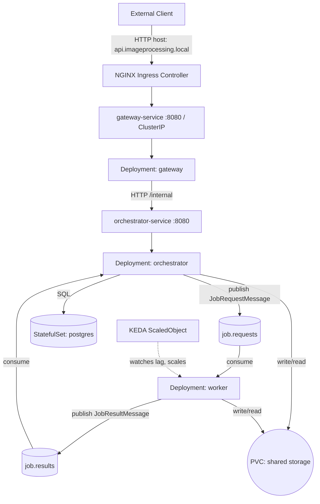
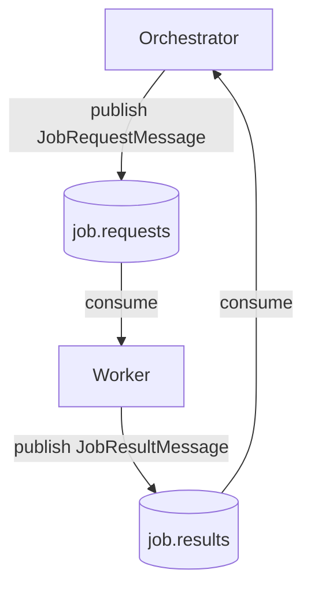

# Sprint 3 : Kubernetes Deployment — Complete Recap

**Cloud-Native Image Processing : Kubernetes Deployment Phase** _Romano Nicola . SUPSI DTI-ISIN . July 2026_

> Consolidates the full Kubernetes deployment arc — Minikube setup through Ingress, probes, pod design patterns, the Kafka job queue, and KEDA autoscaling — into a single reference document, in the same format as `sprint-1-recap.md` and the `sprint-2-*-recap.md` pair. Supersedes `1-k8s-setup.md` through `10-keda.md` and the two interim `sprint-3-kafka-recap.md` / `sprint-3-elastic-scaling-recap.md` documents as the canonical reference; those are kept as the detailed development log. Where an older note and the manifests actually on disk disagree, this document follows the manifests (flagged explicitly where relevant — see §7.1).

---

## Table of Contents

[[ _TOC_ ]]

---

## 1. Architecture Overview

The containerized stack from Sprint 2 (`sprint-2-containerization-recap.md`) is deployed onto Kubernetes as five workloads across two controller types, fronted by an Ingress, backed by a Kafka-mediated job queue, and elastically scaled on the compute-heavy tier.



**Workload inventory:**

| Component | Kind | Replicas | Exposed via | Notes |
|---|---|---|---|---|
| `gateway` | Deployment | 1 | `gateway-service` (ClusterIP) + Ingress | Single external entry point |
| `orchestrator` | Deployment | 1 | `orchestrator-service` (ClusterIP) | `initContainer: wait-for-postgres` |
| `worker` | Deployment | 1, elastic 1–10 | none (Kafka consumer only) | Scaled by `kafka-scaledobject` |
| `postgres` | StatefulSet | 1 | `postgres` Service (ClusterIP) | Stable pod DNS, `volumeClaimTemplates` |
| `kafka` | StatefulSet | 1 | `kafka` Service (headless) | KRaft mode, no Zookeeper |

Everything lives in the `imageprocessing` namespace (`namespace.yml`) — confirmed as the single, consistent name across every manifest in the repository (no `image-processing` variants remain anywhere on disk).

---

## 2. Local Environment & Tooling

Established in `1-k8s-setup.md`, unchanged since:

| Tool | Version | Install (Arch Linux) |
|---|---|---|
| `kubectl` | v1.36.2 | `sudo pacman -S kubectl` |
| `minikube` | v1.38.1 | `sudo pacman -S minikube` |

```bash
minikube start
kubectl get nodes   # confirms a single control-plane node — see §5.3, §11.3 for why this matters
```

**Building images for Minikube** — Minikube runs its own isolated Docker daemon, so host-built images are invisible to it unless the shell targets Minikube's daemon first:

```bash
eval $(minikube docker-env)   # per-terminal; does not persist across sessions
docker compose build
minikube image load postgres:18-alpine   # third-party images already on the host
```

**Evolution of the manifest layout:** the project began with bare `Pod` manifests (one `pod.yml` per service, `imagePullPolicy: Never` since nothing is pushed to a registry) purely to confirm scheduling worked, before any resilience concerns were introduced — see §6 for the migration to Deployments/StatefulSets.

---

## 3. Namespace, ConfigMaps & Secrets

### 3.1 Namespace

```yaml
# namespace.yml
apiVersion: v1
kind: Namespace
metadata:
  name: imageprocessing
```

Every subsequent manifest declares `namespace: imageprocessing`. Without the flag, `kubectl get pods` 2-namespaces-configmaps-secrets.md`.

### 3.2 Secrets

The only secret is PostgreSQL's credentials, shared between `postgres` and `orchestrator`. `postgres/secret.yml` is git-ignored (`k8s/**/secret.yml`); `postgres/secret.example.yml` is committed as the template:

```yaml
apiVersion: v1
kind: Secret
metadata:
  name: postgres-secret
  namespace: imageprocessing
type: Opaque
stringData:
  POSTGRES_USER: postgres_user_example
  POSTGRES_PASSWORD: postgres_pw_example
```

**Key-naming mismatch:** the official `postgres:18-alpine` image hardcodes `POSTGRES_USER`/`POSTGRES_PASSWORD`/`POSTGRES_DB` at the entrypoint level, while Spring Boot's `application.properties` reads `POSTGRES_USER_NAME`/`POSTGRES_USER_PASSWORD`. Rather than maintaining two secrets with duplicated values, the secret keeps Postgres's expected names and the orchestrator Deployment maps them explicitly:

```yaml
env:
  - name: POSTGRES_USER_NAME
    valueFrom:
      secretKeyRef: { name: postgres-secret, key: POSTGRES_USER }
  - name: POSTGRES_USER_PASSWORD
    valueFrom:
      secretKeyRef: { name: postgres-secret, key: POSTGRES_PASSWORD }
```

`postgres` itself consumes the same secret via a blanket `envFrom: secretRef`, since it wants the keys verbatim.

### 3.3 ConfigMaps

One `ConfigMap` per service — no service reads another's, enforcing least privilege and letting one service's config change without side effects elsewhere.

| ConfigMap | Key variables |
|---|---|
| `gateway-config` | `ORCHESTRATOR_URL=http://orchestrator-service:8080/internal` |
| `orchestrator-config` | `POSTGRES_DB`, `POSTGRES_HOST=postgres`, `STORAGE_DATA_DIR=/data/imageprocessing`, `ORCHESTRATOR_PORT`, `KAFKA_BOOTSTRAP_SERVERS=kafka:9092` |
| `worker-config` | `STORAGE_DATA_DIR`, `HF_HOME`, `U2NET_HOME`, `WORKER_PORT=8080`, `KAFKA_BOOTSTRAP_SERVERS=kafka:9092`, `JOB_REQUESTS_TOPIC`, `JOB_RESULTS_TOPIC`, `KAFKA_CONSUMER_GROUP=ai-worker` |
| `postgres-config` | `POSTGRES_DB`, `POSTGRES_HOST=postgres` |
| `kafka-config` | KRaft broker settings — see §9.4 |

All pods consume their ConfigMap/Secret via `envFrom` rather than enumerating individual `env` entries (except the two explicit `secretKeyRef` mappings in §3.2), keeping pod specs decoupled from the specific variable names inside.

**Scheme correction carried from Sprint 2:** URL-valued config entries must include `http://` — Docker Compose tolerated bare hostnames in some contexts, Kubernetes does not.

---

## 4. Labels, Services & Internal DNS

Kubernetes has no automatic DNS registration for bare Pods — unlike Compose, where container names resolve automatically. A `Service` is required in front of every pod that needs to be reachable, and its `selector` matches pods by label.

| Pod | Labels |
|---|---|
| `gateway` | `app: gateway`, `layer: web` |
| `orchestrator` | `app: orchestrator`, `layer: backend` |
| `worker` | `app: worker`, `layer: backend` |
| `postgres` | `app: postgres`, `layer: data` |
| `kafka` | `app: kafka`, `layer: backend` |

**Service naming is not cosmetic** — `orchestrator-config`'s `POSTGRES_HOST: postgres` and `worker-config`'s Kafka bootstrap value only resolve if the Services are literally named `postgres` and `kafka`. Misnaming a Service produces `UnknownHostException` at runtime even with every pod otherwise healthy — this exact failure mode was hit and fixed during initial setup (`3-labels-and-services.md`).

**Gateway exposure evolved.** `3-labels-and-services.md` originally specified `NodePort` for `gateway-service`, reachable directly from the Minikube node. Once the NGINX Ingress Controller was introduced (§7), `6-ingress.md` explicitly calls `NodePort` "insufficient for a production-grade architecture," and the manifest actually on disk today is:

```yaml
# gateway/service.yml
apiVersion: v1
kind: Service
metadata:
  name: gateway-service
spec:
  selector: { app: gateway }
  ports: [{ port: 8080, targetPort: 8080 }]
  type: ClusterIP
```

`ClusterIP` is correct here precisely because the Ingress Controller — not the backend Service — is now the thing exposed to the outside. This document follows the current manifest, per the instruction to prefer YAML over prose notes when the two disagree.

All other Services (`postgres`, `orchestrator-service`, and `kafka`) remain `ClusterIP` or headless, since none of them should ever be reached directly from outside the cluster.

---

## 5. Persistent Storage: Volumes & Claims

Two categories of state must survive pod restarts: ML model files (large, slow to re-download, network-restricted in Minikube) and processed image files (in-flight job data).

### 5.1 Dynamic Provisioning — ML Model Caches

```yaml
# worker/pvc-model-cache.yml, worker/pvc-rembg-cache.yml
storageClassName: standard
accessModes: [ReadWriteOnce]
resources: { requests: { storage: 10Gi } }
```

Minikube's built-in `standard` StorageClass auto-provisions the backing PV. `ReadWriteOnce` was correct when only one Worker pod ever existed — **this assumption is now stale** given KEDA can run up to 10 Worker replicas concurrently (§10); see §11.1 for the open follow-up.

### 5.2 Static Provisioning — Shared Storage

`STORAGE_DATA_DIR` is written by the orchestrator (uploads) and read/written by the Worker (processing outputs) — genuinely shared, unlike the per-Worker model caches. Minikube's `standard` StorageClass only supports `ReadWriteOnce`, so this volume is provisioned statically instead:

```yaml
# storage/pv-shared-storage.yml
apiVersion: v1
kind: PersistentVolume
metadata: { name: pv-shared-storage }
spec:
  storageClassName: manual
  capacity: { storage: 5Gi }
  accessModes: [ReadWriteOnce]
  hostPath: { path: /data/imageprocessing }
```

```yaml
# storage/pvc-shared-storage.yml
apiVersion: v1
kind: PersistentVolumeClaim
metadata: { name: pvc-shared-storage, namespace: imageprocessing }
spec:
  storageClassName: manual
  volumeName: pv-shared-storage
  accessModes: [ReadWriteOnce]
  resources: { requests: { storage: 5Gi } }
```

**Design decision log and update plan over `hostPath`.** This PV previously declared `ReadWriteMany` while backed by `hostPath`. Kubernetes accepts that combination syntactically, but `hostPath` has no attach/detach mechanism for the kubelet to enforce access modes against — the field was decorative, not a real guarantee. In practice:

- Two Worker pods on the **same** node transparently shared the directory — looked correct.
- A Worker pod scheduled to a **different** node got its own node's empty, disconnected local path — silent `FileNotFoundError`, no scheduling error to explain why.

This is now declared `ReadWriteOnce`, matching what `hostPath` can actually deliver. The relabeling doesn't fix the underlying multi-node risk by itself — `hostPath` still can't enforce anything — but the manifest no longer claims a guarantee it can't keep. The real constraint is enforced operationally instead: **the cluster stays single-node (Minikube) until this migrates to a genuine `ReadWriteMany` backend.** On a single-node cluster, every Worker replica lands on the same node by construction, so the multi-node inconsistency cannot occur. No `nodeAffinity` was added to enforce this explicitly, since it would be redundant on a cluster with exactly one node — flagged in §11.1 as a follow-up the moment a second node is added before the storage migration lands.

**Planned migration**, tracked against the roadmap's cloud-provisioning phase:

| | Now (Minikube) | Planned (cloud) |
|---|---|---|
| Backing mechanism | `hostPath` | NFS / cloud file share (Filestore, EFS, Azure Files) |
| `accessModes` | `ReadWriteOnce` (honest) | `ReadWriteMany` (actually enforced) |
| Multi-node Worker scaling | Constrained to 1 node | Fully supported |

### 5.3 StatefulSet-Managed Storage

`postgres` and `kafka` each provision their own storage via `volumeClaimTemplates` rather than a standalone PVC — see §6.2 for why this is a StatefulSet responsibility.

### 5.4 Reclaim Policy

The statically-provisioned `pv-shared-storage` uses `Retain` (the default for static PVs) — deleting the PVC keeps the PV and data for manual reclaim. The dynamically-provisioned model-cache PVs use `Delete` — their backing storage disappears with the PVC. Deliberately asymmetric: shared storage holds user-facing data worth protecting against accidental deletion; model caches are trivially reconstructible by re-downloading.

---

## 6. Deployments & StatefulSets

### 6.1 From Bare Pods to Deployments

Bare `Pod` manifests (§2) proved scheduling worked but are fragile: a node crash or an OOM-killed pod is gone permanently, and scaling means hand-duplicating manifests. `gateway`, `orchestrator`, and `worker` were converted to `Deployment` — the environment variables, `envFrom`, and volume mounts carried over unchanged from the bare-pod specs; only the `spec.template.spec` wrapping is new. All three are stateless from Kubernetes's perspective (state lives in Postgres/PVCs, not container-local storage), so the Deployment controller can freely destroy and recreate them across nodes without data loss.

### 6.2 Why Postgres and Kafka Need StatefulSets

Databases and (in KRaft mode) the Kafka broker both need startup-ordering guarantees, stable network identity, and volumes that reattach to the *same* instance on restart — none of which a Deployment provides. A `StatefulSet` gives:

- **Stable DNS** — always `postgres-0` / `kafka-0`, never a random hash suffix.
- **`volumeClaimTemplates`** — Kubernetes provisions and re-binds the same PVC per replica automatically, rather than a manually pre-created PVC shared across possibly-different pod instances.

```yaml
# postgres/statefulset.yml (excerpt)
volumeClaimTemplates:
  - metadata: { name: postgres-data }
    spec:
      accessModes: [ReadWriteOnce]
      resources: { requests: { storage: 2Gi } }
```

```yaml
# kafka/statefulset.yml (excerpt)
serviceName: kafka   # must match the headless Service — see §9.4
volumeClaimTemplates:
  - metadata: { name: kafka-data }
    spec:
      accessModes: [ReadWriteOnce]
      resources: { requests: { storage: 5Gi } }
```

### 6.3 Init Container: `wait-for-postgres`

Kubernetes starts all pods concurrently — unlike Compose's `depends_on: condition: service_healthy`. Without ordering, `orchestrator` would attempt to open a connection pool before Postgres finished initializing, producing crash loops even though increased probe delays alone (§8) had already prevented Kubernetes from prematurely killing the pod.

```yaml
initContainers:
  - name: wait-for-postgres
    image: postgres:18-alpine
    command: ["sh", "-c", "until pg_isready -h postgres -U $POSTGRES_USER -d $POSTGRES_DB; do sleep 2; done"]
```

Init containers run sequentially before the main container and block it in `PodInitializing` until they succeed, restarting on failure. With this in place, `orchestrator`'s `livenessProbe.initialDelaySeconds` was safely reduced from a temporary 60s workaround back to 15s (§8), since the init container — not a padded liveness delay — now absorbs the concurrent-startup race.

### 6.4 Patterns Evaluated and Dismissed

- **Sidecar** (e.g. a local logging agent) — unnecessary; logs already go to stdout and Kubernetes handles collection natively.
- **Adapter** (normalizing metrics for a monitoring backend) — unnecessary; Spring Boot + Micrometer already emit standard-format metrics.

---

## 7. Ingress: External Access

**Decision:** NGINX Ingress Controller over `NodePort` or port-forwarding, for proper Layer 7 routing at production scale.

```bash
minikube addons enable ingress
```

```yaml
# gateway/ingress.yml
apiVersion: networking.k8s.io/v1
kind: Ingress
metadata: { name: gateway-ingress, namespace: imageprocessing }
spec:
  ingressClassName: nginx
  rules:
    - host: api.imageprocessing.local
      http:
        paths:
          - path: /
            pathType: Prefix
            backend:
              service: { name: gateway-service, port: { number: 8080 } }
```

Local DNS is simulated by appending the Minikube VM's IP to `/etc/hosts` (`192.168.49.2 api.imageprocessing.local`), standing in for what a real DNS A-record would do against a public load balancer in production.

### 7.1 Note on the Superseded `NodePort` Description

As covered in §4, an earlier note (`3-labels-and-services.md`) still describes `gateway-service` as `NodePort` — accurate at the time it was written, before Ingress existed. The manifest on disk is `ClusterIP`, and that's what's deployed today. Documented here explicitly so the two sources don't read as contradictory without explanation.

---

## 8. Probes: Readiness, Liveness, Startup

Without probes, Kubernetes routes traffic to any `Running` pod regardless of internal state, and only restarts on process crash — not on "silently broken but still alive."

| Mechanism | Used by | How |
|---|---|---|
| `httpGet` | gateway, orchestrator (`/actuator/health`), worker (`/health`) | 2xx/3xx = success |
| `exec` | postgres (`pg_isready`) | exit code 0 = success |

**Timing, by service:**

| Service | Readiness delay | Liveness delay | Rationale |
|---|---|---|---|
| orchestrator | 15s | 15s (reduced from a temporary 60s, §6.3) | Init container now absorbs the Postgres-race window |
| worker | startup probe: up to 150s (30 × 5s) | readiness/liveness kick in only after startup passes | ML model loading takes 60–120s; a `startupProbe` handles this more precisely than a blanket `initialDelaySeconds` |
| postgres | 10s | 60s | Postgres 18 first-boot initialization (DB + user creation) is slow; too-low liveness previously killed the pod mid-init |

**Rule of thumb enforced throughout:** `livenessProbe.initialDelaySeconds` must exceed `readinessProbe.initialDelaySeconds`, or liveness can kill a pod that's still legitimately starting up.

**Two mount-path corrections, non-obvious and worth keeping visible:**

- **Postgres PVC mounts at `/var/lib/postgresql`, not `/var/lib/postgresql/data`.** Postgres 18 Alpine enforces strict ownership/permission checks on its `data/` subdirectory; mounting the PVC directly onto `/data` caused the engine to deliberately crash on startup. Mounting one level up lets Postgres manage `data/` itself.
- **Shared storage permissions on the Minikube node** required `minikube ssh -- sudo chmod 777 /data` as a local-dev workaround, since the `hostPath` directory defaults to root ownership and `orchestrator` runs as non-root `appuser`. The documented correct fix for a cloud cluster is a pod-spec `securityContext.fsGroup` matching the app's GID, so Kubernetes recursively chowns the volume on mount — not yet applied since this stays local for now (§5.2).

---

## 9. Messaging: Kafka Job Queue

### 9.1 From Synchronous HTTP to Async Messaging

Sprint 2 had the orchestrator call the Worker synchronously over HTTP from within an `@Async` thread (`sprint-2-microservices-recap.md`, §8.4) — a thread held for the full duration of AI inference, with no buffering under load. Sprint 3 replaces that with two topics:



1. `POST /api/jobs/{id}/process` -> Orchestrator assigns `targetStorageKey`, sets status `RUNNING`, publishes `JobRequestMessage`, returns immediately.
2. Worker consumes, processes on a thread-pool executor, writes the output, publishes `JobResultMessage` (`DONE`/`FAILED`).
3. `JobResultListener` (Orchestrator) applies the result to PostgreSQL.
4. `GET /api/jobs/{id}` — unchanged; it only ever reads the DB.

### 9.2 Design Decisions

- **Two topics, not one per job type.** `job_type` travels inside the payload. This mirrors the Orchestrator's exhaustive `switch` on `JobType` (no `default` arm — a new type is a compile error until handled): a new job type becomes a new dispatch-table/switch arm, not new topic provisioning.
- **Keyed by `jobId`** on both topics — guarantees per-job ordering on a single partition, relevant if a job is ever resubmitted.
- **Storage key ownership stays with the Orchestrator.** `processJob()` assigns `targetStorageKey` via `UUID.randomUUID()` **before** publishing — not the Worker, and not `JobResultListener` on completion. An early draft assigned it at completion instead; reverted because creation-time assignment is idempotent under Kafka redelivery (a reprocessed message always targets the same file) and keeps `GET /api/jobs/{id}` accurate the instant a job goes `RUNNING`, rather than only after the Worker replies. `JobResultListener` reads the Worker's echoed `target_sk` back only as a correlation check — a mismatch is logged as a warning, never adopted as a new value.
- **At-least-once delivery, handled explicitly, not via exactly-once machinery.** The Worker's `AIOKafkaConsumer` commits its offset only *after* publishing to `job.results` — a crash mid-inference causes redelivery, not silent loss. `JobResultListener` is idempotent (replaying the same status twice is harmless). **Known, documented gap:** if the Orchestrator's `KafkaTemplate.send()` itself fails (broker unreachable), the job goes straight to `FAILED` with no retry — a transactional outbox would close this, judged out of scope for this sprint.
- **`aiokafka` over `confluent-kafka`** on the Worker — fits the existing FastAPI `lifespan` pattern already used to load the `rembg`/DETR models once at boot; the consumer loop runs as a native `asyncio` task in that same `lifespan` rather than needing a separate thread bridged into the event loop. The blocking processing functions are offloaded via `loop.run_in_executor(...)` so the event loop stays free to serve `/health` and keep polling Kafka mid-job.
- **Single-broker KRaft mode, no Zookeeper** — proportionate to thesis scale, one fewer component to operate alongside Postgres and the eventual service mesh.

### 9.3 Message Schemas

```json
// JobRequestMessage — job.requests
{ "job_id": 42, "job_type": "FORMAT_CONVERSION", "source_sk": "...", "target_sk": "...", "input_format": "png", "output_format": "jpg" }
```

```json
// JobResultMessage — job.results
{ "job_id": 42, "status": "DONE", "target_sk": "...", "error_message": null }
```

`status` is a plain string, not the Java `JobStatus` enum, so the Python side carries no Java-flavoured type dependency.

### 9.4 Kubernetes Objects

```yaml
# kafka/configmap.yml (excerpt — KRaft settings)
KAFKA_NODE_ID: "1"
KAFKA_PROCESS_ROLES: "broker,controller"
KAFKA_ADVERTISED_LISTENERS: "PLAINTEXT://kafka-0.kafka.imageprocessing.svc.cluster.local:9092"
KAFKA_CONTROLLER_QUORUM_VOTERS: "1@kafka-0.kafka.imageprocessing.svc.cluster.local:9093"
KAFKA_AUTO_CREATE_TOPICS_ENABLE: "false"   # deliberate — see topic creation below
```

```yaml
# kafka/service.yml — headless, required for StatefulSet pod DNS + KRaft voter resolution
spec:
  clusterIP: None
  selector: { app: kafka }
  ports: [{ name: broker, port: 9092 }, { name: controller, port: 9093 }]
```

Topics are created explicitly by a one-shot `Job` rather than relying on auto-create, so partition count is a deliberate choice:

```yaml
# job.yml (current)
--create --if-not-exists --topic job.requests --partitions 10 --replication-factor 1
--create --if-not-exists --topic job.results  --partitions 3  --replication-factor 1
```

`--if-not-exists` makes re-running the `Job` safe. See §10.2 for why `job.requests` specifically needs 10 partitions.

---

## 10. Elastic Scaling: KEDA

### 10.1 KEDA over Plain HPA

The default `HorizontalPodAutoscaler` scales on CPU/memory — a poor proxy here, since a Worker doing inference can sit at high CPU with only one job in flight while ten queued jobs behind it produce no CPU signal until picked up. KEDA's `kafka` scaler reads **consumer lag on `job.requests`** directly and drives a standard HPA underneath, so scaling tracks actual backlog rather than a CPU approximation of it.

```yaml
# keda.yml
apiVersion: keda.sh/v1alpha1
kind: ScaledObject
metadata: { name: kafka-scaledobject, namespace: imageprocessing }
spec:
  scaleTargetRef: { name: worker }        # apps/v1 Deployment, matches worker/deployment.yml
  minReplicaCount: 1                       # keeps one Worker warm — avoids scale-from-zero cold start
  maxReplicaCount: 10                       # bounded by job.requests partition count, see §10.2
  triggers:
    - type: kafka
      metadata:
        bootstrapServers: kafka.imageprocessing.svc.cluster.local:9092
        consumerGroup: ai-worker            # must match worker-config's KAFKA_CONSUMER_GROUP
        topic: job.requests
        lagThreshold: '10'                  # +1 replica per 10 messages of backlog
        offsetResetPolicy: latest
```

`minReplicaCount: 1` specifically accounts for model-load time (§8): scaling from zero would leave the first job queued for the full 60–120s load window.

### 10.2 Partitioning as the Real Scaling Ceiling

Kafka assigns at most one partition per consumer in a group — a partition never splits across two consumers. `maxReplicaCount` is therefore bounded by `job.requests`'s partition count, not just a safety cap: any replica beyond the partition count gets no partitions and sits fully idle. `job.requests` is provisioned with **10 partitions** (§9.4) specifically to match `maxReplicaCount: 10` — the two numbers are aligned deliberately. Partitions can be added to an existing topic without data loss but never reduced, so over-provisioning up front is the safer direction to round.

### 10.3 Operator Installation

```bash
helm repo add kedacore https://kedacore.github.io/charts
helm repo update
helm install keda kedacore/keda --namespace keda --create-namespace
```

### 10.4 Validation

`10-keda.md` documents a synthetic load test bypassing the Orchestrator entirely — publishing directly to `job.requests` to isolate scaling behavior from the rest of the pipeline:

```bash
kubectl exec -it kafka-0 -n imageprocessing -- /bin/bash -c "
for i in {1..30}; do
  echo '{\"job_id\": \"scale-test-'$i'\", \"job_type\": \"BACKGROUND_REMOVAL\", ...}'
done | /opt/kafka/bin/kafka-console-producer.sh --broker-list localhost:9092 --topic job.requests
"
```

30 messages against `lagThreshold: 10` should drive the Worker toward `ceil(30/10) = 3` replicas. **Not yet validated:** whether all 10 replicas can actually be *scheduled* on the current single-node Minikube cluster — no CPU/memory `resources.requests` are set on the Worker container, so node capacity, not the KEDA/Kafka ceiling, may be the real limit in practice (§11.1).

---

## 11. Cross-Cutting Design Decisions

Consolidated view of decisions that span multiple sections above:

| Decision | Where | Reasoning, in one line |
|---|---|---|
| Namespace consistently `imageprocessing` | §1, all manifests | A single typo (`image-processing`) silently breaks Service DNS; verified consistent across every current manifest |
| Postgres secret keys kept as Postgres expects, mapped explicitly for Spring | §3.2 | One secret, two consumers with different naming conventions — solved with `secretKeyRef`, not a duplicated secret |
| `gateway-service`: `NodePort` -> `ClusterIP` | §4, §7.1 | Superseded once Ingress took over external routing; documented explicitly since an older note still says `NodePort` |
| Storage key (`targetStorageKey`) assigned at job creation, not completion | §9.2 | Single source of truth; idempotent under Kafka redelivery; correct value visible while `RUNNING`, not just at `DONE` |
| At-least-once Kafka delivery, not exactly-once | §9.2 | Exactly-once needs transactional producers/consumers on both JVM and Python sides — disproportionate for this scale; handled explicitly instead (commit-after-publish, idempotent listener) |
| Shared storage relabeled `RWO` on `hostPath` | §5.2 | `hostPath` never enforced `RWX` in the first place; the manifest now states what it can actually deliver |
| Single-node Minikube as the interim multi-node-safety mechanism | §5.2, §10.4 | No `nodeAffinity` added — redundant on a true single-node cluster; becomes necessary the moment a second node exists before the storage migration lands |

### 11.1 Still-Open Follow-Ups

| Item | Status | Why it's not done yet |
|---|---|---|
| Shared storage -> NFS/cloud RWX backend | Deferred | Blocked on the roadmap's cloud-provisioning phase; single-node cluster is the interim safeguard |
| ML model cache PVCs still `RWO` on `standard` | Deferred | Same multi-node risk as shared storage had, not yet addressed; candidate fix is baking the models into the Worker image at build time instead of caching them at all, since they're static read-mostly artifacts |
| Worker `resources.requests`/`limits` | Open | Needed to know whether `maxReplicaCount: 10` is schedulable in practice, independent of the Kafka-lag trigger |
| `nodeAffinity` on Worker | Not implemented, intentionally | Would be redundant today; revisit if a second node is added before the storage migration |

---

## 12. Full Deployment Command Reference

Dependency-ordered `kubectl apply`, consolidating every object introduced across this document:

```bash
# 1. Namespace first — everything else references it
kubectl apply -f namespace.yml

# 2. Secrets and ConfigMaps
kubectl apply -f postgres/secret.yml        # from your local copy; never commit this file
kubectl apply -f postgres/configmap.yml
kubectl apply -f orchestrator/configmap.yml
kubectl apply -f worker/configmap.yml
kubectl apply -f gateway/configmap.yml
kubectl apply -f kafka/configmap.yml

# 3. Storage — before anything that mounts it
kubectl apply -f storage/pv-shared-storage.yml
kubectl apply -f storage/pvc-shared-storage.yml
kubectl apply -f worker/pvc-model-cache.yml
kubectl apply -f worker/pvc-rembg-cache.yml

# 4. Data tier
kubectl apply -f postgres/service.yml
kubectl apply -f postgres/statefulset.yml

# 5. Kafka broker, then topics
kubectl apply -f kafka/service.yml
kubectl apply -f kafka/statefulset.yml
kubectl apply -f job.yml                     # kafka-create-topics, 10/3 partitions

# 6. Application tier
kubectl apply -f orchestrator/service.yml
kubectl apply -f orchestrator/deployment.yml
kubectl apply -f worker/deployment.yml
kubectl apply -f gateway/service.yml
kubectl apply -f gateway/deployment.yml

# 7. Autoscaling and external access
kubectl apply -f keda.yml
kubectl apply -f gateway/ingress.yml
```

```bash
kubectl get pods,statefulsets,deployments -n imageprocessing
kubectl get pvc -n imageprocessing
curl -I http://api.imageprocessing.local
```

---

## 13. Sprint Completion Status

| Task | Acceptance Criterion | Status | Notes |
|---|---|---|---|
| Minikube + kubectl setup | Cluster schedulable, bare pods running | Done | §2 |
| Namespace isolation | All resources under `imageprocessing` | Done | Verified consistent across every manifest, no typos (§1) |
| Secrets / ConfigMaps | Credentials git-ignored, config injected via `envFrom` | Done | Postgres key-naming mismatch resolved via explicit `secretKeyRef` (§3.2) |
| Labels & Services | Inter-pod DNS working for all five workloads | Done | §4 |
| Persistent storage | Model caches (dynamic) + shared storage (static) both bound | Done | Shared storage access mode corrected to match `hostPath` reality (§5.2) |
| Deployments & StatefulSets | Bare pods migrated, resilient to crashes | Done | §6 |
| Ingress | External routing via NGINX, host-based | Done | `gateway-service` correctly `ClusterIP` under Ingress (§7) |
| Probes | Readiness/liveness/startup tuned per service | Done | §8 |
| Init container pattern | `wait-for-postgres` eliminates startup race | Done | §6.3 |
| Kafka job queue | `job.requests`/`job.results`, at-least-once, storage-key ownership fixed | Done | §9 |
| KEDA autoscaling | Worker scales 1–10 on Kafka lag | Done | Partition count aligned to `maxReplicaCount` (§10.2) |
| Shared storage multi-node safety | RWX backend (NFS/cloud) | **Open** | Deferred to cloud-provisioning phase; single-node cluster is the interim constraint |
| ML model cache multi-node safety | Bake into image or RWX backend | **Open** | Not yet started |
| Worker resource requests/limits | Scheduling headroom validated for 10 replicas | Done | Needed before treating `maxReplicaCount: 10` as a validated ceiling |
