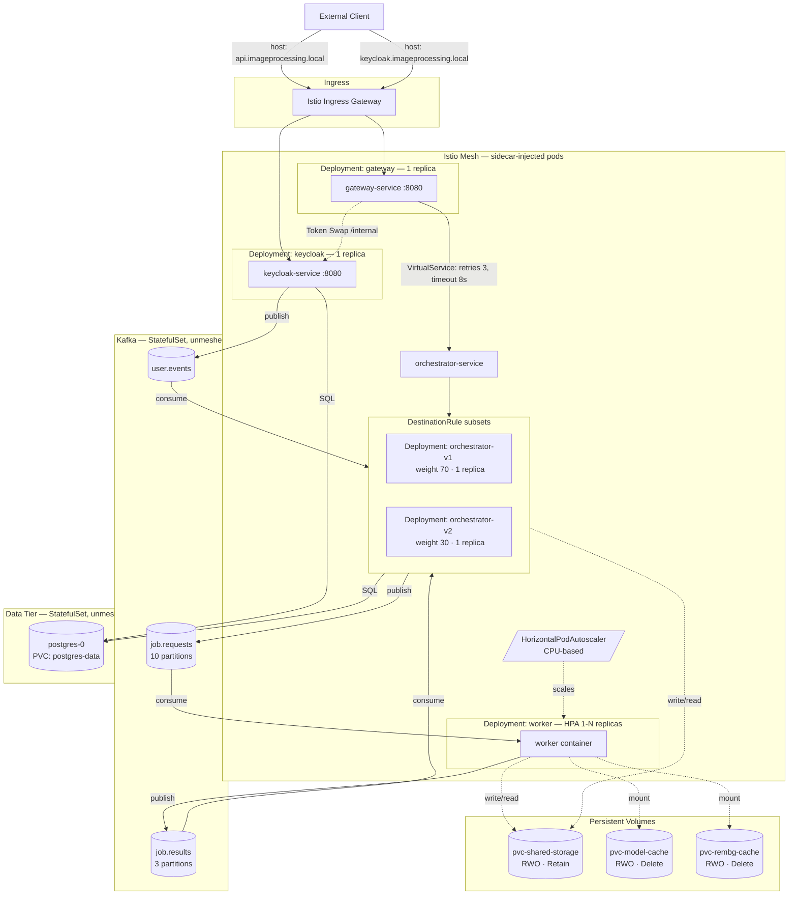

# Sprint 5 : Service Mesh Integration Recap

**Cloud-Native Image Processing : Service Mesh Phase**
_Romano Nicola . SUPSI DTI-ISIN . September 2026_

> This document consolidates the integration of the Istio service mesh into the Kubernetes architecture, replacing the standard NGINX ingress and introducing L7 traffic management, circuit breaking, and weighted canary deployments.

## Table of Contents
[[ _TOC_ ]]

## 1. Architecture Overview
Sprint 5 introduces Istio (v1.30.3) to govern the network space *between* the microservices. Rather than relying on basic Kubernetes internal DNS and an external NGINX controller, traffic is now intercepted by Envoy sidecar proxies. This enables advanced resilience patterns (retries, timeouts, circuit breakers) and progressive delivery (canary routing) without modifying application code.

## 2. Phase 0: Mesh Bootstrap & Injection Scope

The `demo` profile was used for installation to ensure relaxed resource requests, accommodating the single-node Minikube cluster's capacity constraints.

### 2.1 Sidecar Injection Decisions
Automatic sidecar injection is enabled via namespace label (`istio-injection=enabled`), but the data and messaging tiers were **explicitly opted out** via pod-level annotations (`sidecar.istio.io/inject: "false"`):
*   **Postgres:** Excluded to avoid disrupting the hand-tuned probe timing and `initContainer` startup sequences established in Sprint 3.
*   **Kafka:** Excluded because KRaft's controller-quorum voter address depends heavily on pristine DNS resolution. Adding a proxy hop into the raw TCP consensus protocol introduces fragility for zero HTTP routing benefit.

### 2.2 Ingress Replacement
The NGINX Ingress Controller deployed in Sprint 3 was explicitly retired (`minikube addons disable ingress`). External routing for `api.imageprocessing.local` and `keycloak.imageprocessing.local` is now fully managed by an Istio `Gateway` resource and passthrough `VirtualService` objects, establishing a single source of routing truth.

## 3. Phase 1: Traffic Management & Resilience

Traffic management is scoped exclusively to the HTTP hops that the mesh can meaningfully act on: `Ingress -> Frontend` and `Frontend -> Orchestrator`. The Orchestrator -> Worker link is excluded because it was migrated to asynchronous Kafka messages in Sprint 3.

### 3.1 DestinationRule (Circuit Breaking)
A `DestinationRule` for the Orchestrator configures connection pooling and outlier detection to protect the backend under load:
*   `maxConnections: 50` / `http1MaxPendingRequests: 20`: Deliberately generous to establish the mechanism without disrupting normal thesis-scale traffic.
*   `consecutive5xxErrors: 5` and `maxEjectionPercent: 100`: Since the Orchestrator runs as a single replica, ejecting 100% of the pool is allowed. Ejecting the sole replica fast-fails the Gateway's retries against a definitively unhealthy backend rather than causing cascading thread exhaustion.

### 3.2 VirtualService (Timeouts & Retries)
Timeouts and retries are layered to prevent inner hops from exhausting outer hop budgets:
*   **Internal (Frontend -> Orchestrator):** `timeout: 5s`, `attempts: 2` (2s per try). Excludes 4xx errors (`retryOn: 5xx,reset,connect-failure`) to avoid wasting budget on structurally invalid requests.
*   **External (Ingress -> Frontend):** `timeout: 8s`, `attempts: 1`. The outer timeout is deliberately longer than the inner one to prevent the client from dropping the connection while the internal mesh is still executing a valid retry.

### 3.3 Validation & Caveats
*   **Fault Injection Interaction:** Discovered and documented that combining `fault.delay` and `timeout` on the *same* `VirtualService` route causes Envoy to silently ignore the timeout. Fault injection was proven using a delay-only test (3s configured delay = 3.01s observed wall-clock).
*   **Zero-Replica Fast Fail:** Scaling the orchestrator to 0 replicas resulted in an immediate (`0.01s`) `503 no healthy upstream` error, proving the mesh degrades gracefully and fails fast via endpoint-discovery awareness before timeouts even elapse.
*   **In-Mesh Load Testing:** Circuit breakers were validated using concurrent `curl` bursts from an in-mesh throwaway pod, yielding clear `x-envoy-overloaded: true` headers on rejected requests.

## 4. Phase 2: Canary Deployment

A weighted 70/30 canary split was implemented on the Orchestrator to demonstrate progressive delivery capabilities without downtime. 

### 4.1 Version Differentiation Mechanism
To validate routing without introducing untested application logic, both Orchestrator versions run the **exact same container image**. They differ solely by an `INFO_APP_VERSION` environment variable.
*   The Spring Boot Actuator `/info` endpoint was exposed via `management.endpoints.web.exposure.include=info` and configured to surface environment variables.
*   This provides a clean, independent way to observe which pod served a request (`{"app":{"version":"v1"}}` vs `v2`).

### 4.2 Traffic Splitting
1.  **Deployments:** The single `orchestrator` deployment was split into `orchestrator-v1` and `orchestrator-v2`. Both carry the `app: orchestrator` label (so the Service selects both) but distinct `version: v1/v2` labels.
2.  **DestinationRule:** Added `subsets` based on the `version` labels. Both subsets inherit the shared `trafficPolicy` (circuit breakers) defined in Phase 1.
3.  **VirtualService:** Configured a weighted route: `subset: v1` (70%) and `subset: v2` (30%).

### 4.3 Quantified Validation
A throwaway in-mesh pod was used to execute 10,000 sequential requests against the `/info` endpoint to statistically prove Envoy's weighted round-robin distribution:
*   **v1 responses:** 7,061 (70.61%)
*   **v2 responses:** 2,939 (29.39%)
*   **Conclusion:** The 0.61 percentage-point deviation is well within Envoy's statistical tolerance, proving the split is real, precise, and executed perfectly.

### 4.4 Zero-Downtime Operations
Promotion (100% to v2) or Rollback (100% to v1) requires only a single `kubectl patch virtualservice` command altering the weights. Because both Deployments are already running, these traffic shifts happen with zero pod restarts and zero downtime.

## 5. Sprint 5 Completion Status

| Task | Acceptance Criterion | Status | Notes |
|---|---|---|---|
| **Phase 0: Mesh Bootstrap** | `istiod` and ingress gateway running; app pods injected | Done | `demo` profile used; Kafka and Postgres explicitly excluded via annotation. |
| **Ingress Migration** | NGINX retired; Istio `Gateway` deployed | Done | Single source of routing truth established for external access. |
| **Phase 1: Resilience** | Circuit breaking and timeouts applied | Done | Generous connection pool limits used; `maxEjectionPercent: 100` justified for single-replica. |
| **Fault/Timeout Validation** | Envoy behavior verified via in-mesh testing | Done | Interaction documented (delay disables timeout on same route). `503 no healthy upstream` fast-fail proven. |
| **Phase 2: Canary Split** | 70/30 traffic split on Orchestrator | Done | Split implemented using distinct Deployments, Subsets, and weighted VirtualService. |
| **Canary Validation** | Statistical proof of traffic split | Done | `n=10,000` test yielded 70.61% v1 / 29.39% v2 via Actuator `/info` payload. |
| **Rollback / Promotion Path** | Demonstrated shifting traffic with zero downtime | Done | Documented as a single VirtualService patch operation. |
| **Regression (e2e)** | Suite passes against split configuration | Partial | Sprint 3 `k6` load test currently broken by Sprint 4 OIDC auth; requires re-authoring to support Keycloak login flows. |
